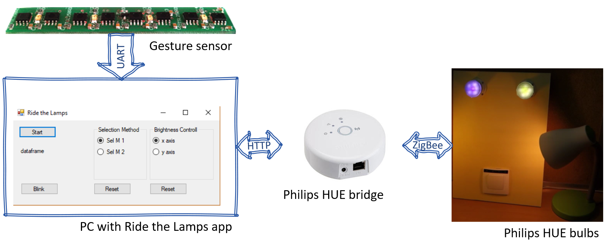
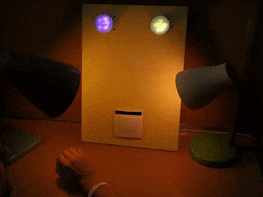
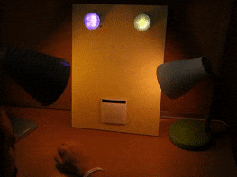
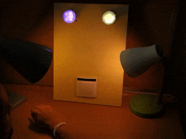
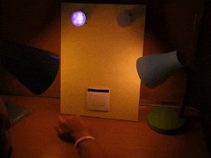

# RideTheLamps

This is a code of PC C# app, which intercepts output dataframes from the touchless gesture sensor, interprets them and sends appropriate commands to Philips Hue bridge to change lights in the surrounding. It was utilized in the research presented at IECON'18 [[1]](https://ieeexplore.ieee.org/document/8591446).

The output dataframe of the gesture sensor contains 4 fields: code of recognized hand pose, performed gesture code (or 'emp' if no gesture was observed), hand position in _x_ axis and hand position in _y_ axis in relation to the sensor (both numbers expressed in percentages).

## Overview
Optical gesture sensor sends information about recognized hand pose/gesture via UART interface. In this implementation the hand pose classification relies on a 2-layer feedforward neural network based gesture recognition system [[2]](https://ieeexplore.ieee.org/abstract/document/8004989/). After pressing 'Start' button on the GUI Ride the Lamps app opens appropriate serial port on the PC and listens for incoming dataframes. If codes of handled gestures are noticed, it sends appropriate requests to a Philips HUE bridge utilizing dedicated REST queries. As a result, control of compatible light sources is taken. In this study, two bulbs lighting system along with one gesture-sensor-based switch were mounted within a plasterboard wall (bottom right corner of the image).

With discrete static gestures active lamp selection is done - e.g. single finger selects right lamp, two fingers select second lamp. Discrete dynamic gestures (hand swipes) can turn on/off active lamp depending on the direction of performed movement (left/right).  
With continuous gestures, e.g. by slowly moving single finger in front of the sensor, brightness of active lamp can be changed.
 
PC application allows to choose between two active lamp selection methods (different gestures trigger other lighting system responses) and two brightness adjustment methods (by hand moving in _x_ or in _y_ axes).

## Demo
One of implemented light source selection methods in action is presented below. Selected lamp/s blink in notification and the control is taken over it. After that, user can e.g. turn it off/on or precisely change brightness level. Gesture sensor is mounted within the light switch.

| Discrete gestures   Left lamp selection |   Discrete gestures   Right lamp selection  |
|----------------|----------------|
| 

 | 

  |
| 
__Discrete gestures   Both lamps selection__
 |   
__Continuous gestures   Lamp brightness adjustment__ 
|
| 

  | 

  |   

For longer and high resolution video click [here](https://www.youtube.com/watch?v=f_GUODe9qrs&index=4&list=PL7O2QC3VBSZ2cHDJ8h-QumI3nmG9e7iEM).

### References
[1] [*"Towards Contactless, Hand Gestures-Based Control of Devices"*, K. Czuszynski, J. Ruminski, IECON'18](https://ieeexplore.ieee.org/document/8591446/)
[2] [*"Pose classification in the gesture recognition using the linear optical sensor"*, K. Czuszynski, J. Ruminski, J. Wtorek, HSI'16](https://ieeexplore.ieee.org/abstract/document/8004989/)
