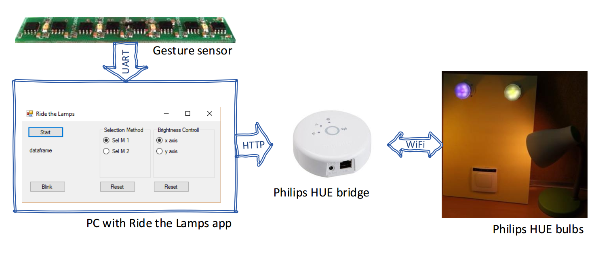

# RideTheLamps

This is a code of PC C# app, which intercepts output from the touchless gesture sensor, interprets it and sends appropriate commands to Philips Hue bridge to change lights in your surrounding.

The output of the gesture sensor contains 4 fields: hand pose code, performed gesture code, hand position in _x_ axis, hand position in _y_ axis (both numbers expressed in percentages).

## Overview
Optical gesture sensor [1](https://ieeexplore.ieee.org/abstract/document/8357549/) sends information about recognized hand pose/gesture via UART interface. Ride the Lamps app opens appropriate port and listens for incoming packages. If recognized commands come, it sends appropriate requests to a Philips HUE bridge utilizing dedicated REST queries. As a result, control of light sources is taken.

With discrete static gestures active lamp source is done - e.g. single finger selects right lamp, two fingers select second lamp. Discrete dynamic gestures (hand swipes) can turn on/off active lamp depending on the direction of performed movement.  
With continuous gestures, e.g. by slowly moving single finger in front of the sensor, brightness of active lamp can be changed.

### References
TBA - Research utilizing this application is to be presented at IECON'18.
